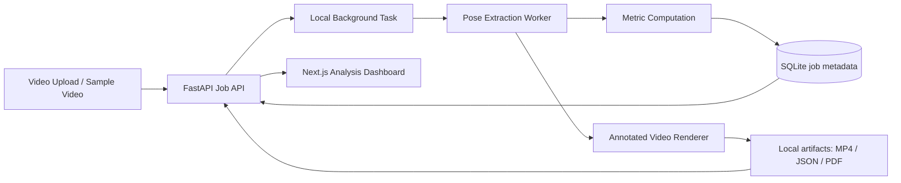

# Sprintform AI

A computer vision sports analytics tool that extracts pose landmarks from athlete videos, computes sprint/jump mechanics, and generates annotated coaching reports.

Sprintform AI is built as a public portfolio MVP. It focuses on practical CV pipeline engineering: video ingestion, pose extraction, biomechanical feature engineering, annotated output video, frame-by-frame dashboard UX, and report exports.

## Scope

This is not medical software and does not claim professional biomechanical accuracy. The MVP reports 2D single-camera normalized estimates. Camera angle, lens distortion, occlusion, clothing, and frame rate can materially affect the numbers.

## Features

- FastAPI upload and sample-analysis API.
- OpenCV video decoding and annotated MP4 rendering.
- MediaPipe Pose Landmarker integration point when a local model is supplied.
- Synthetic fallback/sample pipeline so the public demo runs without private athlete footage.
- Sprint/jump-focused metrics: trunk lean, knee angles, arm angles, ankle separation proxy, and hip-height rhythm.
- SQLite job metadata.
- JSON and PDF report export.
- Next.js App Router analysis workstation with video, timeline, metrics, charts, and exports.
- Pytest coverage for core metric and API behavior.

## Architecture



## Run Locally

Backend:

```powershell
cd backend
python -m venv .venv
.\.venv\Scripts\python -m pip install -r requirements.txt
.\.venv\Scripts\python -m uvicorn app.main:app --host 127.0.0.1 --port 8001 --reload
```

Frontend:

```powershell
cd frontend
npm install
npm run dev
```

Open `http://localhost:3000`, then click `Sample` to generate a synthetic sprint clip and a full analysis report.

## Public Deployment

The Vercel deployment hosts the Next.js workstation from `frontend`. Because the FastAPI/OpenCV worker is a local processing service in this MVP, the public app falls back to bundled demo artifacts under `frontend/public/demo` when the API is unavailable. That keeps the portfolio demo usable while preserving the real local processing pipeline for upload and sample analysis.

## Tests

```powershell
cd backend
.\.venv\Scripts\python -m pytest
```

```powershell
cd frontend
npm run build
```

## Pose Model Notes

The `PoseExtractor` class uses MediaPipe Pose Landmarker when a local `.task` model path is provided. Without a model, the MVP falls back to synthetic landmarks for sample/demo processing. That fallback keeps the public project self-contained and avoids private athlete footage.

Recommended next step: add a model download/setup script and compare MediaPipe against Ultralytics YOLO pose on public sprint/jump clips with documented limitations.
